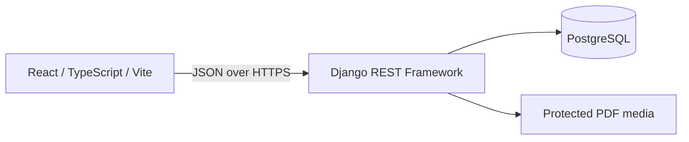

# HireFlow — Job & Applicant Tracking System

HireFlow is a responsive SaaS-style hiring workspace. Candidates create a profile, upload a PDF resume, discover jobs, and track applications. Recruiters create companies and jobs, review applicants, securely open submitted resumes, and move candidates through the hiring pipeline.

## MVP features

- JWT registration and login for candidate and recruiter roles
- Object-level authorization: candidates cannot access recruiter operations and recruiters only see applicants for their companies
- Candidate profile, secure PDF resume upload, saved jobs, public job search, filtering, and applications
- Recruiter company creation, job publishing, job management, applicant search, resume access, and pipeline status updates
- Responsive React interface with loading, empty, error, toast, form validation, and status states
- PostgreSQL persistence, Docker Compose, OpenAPI schema, and an end-to-end backend workflow test

## Architecture



See [the detailed architecture and ER diagram](docs/architecture.md).

## Stack

| Area | Technology |
| --- | --- |
| Frontend | React, TypeScript, Vite, Tailwind CSS, React Router, Axios, TanStack Query |
| Backend | Python 3.12, Django, Django REST Framework, Simple JWT |
| Database | PostgreSQL 16 |
| Delivery | Docker, Docker Compose, Gunicorn |

## Quick start with Docker

```bash
cp .env.example .env
docker compose up --build
```

Open `http://localhost:5173`. The API is available at `http://localhost:8000/api/v1/` and interactive OpenAPI documentation at `http://localhost:8000/api/docs/`.

## Local development

```bash
python -m venv .venv
# Windows PowerShell
.\.venv\Scripts\Activate.ps1
pip install -r backend/requirements/base.txt
cd backend
python manage.py migrate --run-syncdb
python manage.py runserver

# Separate terminal
cd frontend
npm install
npm run dev
```

Set `DATABASE_URL` for PostgreSQL; the Django fallback is SQLite for local experimentation only. Use a unique `SECRET_KEY` and set `DEBUG=false` before a public deployment.

## API surface

| Area | Endpoint examples |
| --- | --- |
| Auth | `POST /api/v1/auth/register/`, `POST /api/v1/auth/login/`, `POST /api/v1/auth/refresh/` |
| Candidate | `/candidate/profile/`, `/candidate/dashboard/`, `/resumes/`, `/applications/` |
| Recruiter | `/companies/`, `/recruiter/dashboard/`, `/recruiter/applications/` |
| Jobs | `GET,POST /jobs/`, `GET,PATCH,DELETE /jobs/{id}/`, `POST /jobs/{id}/save/` |

## Testing

```bash
cd backend
python manage.py test tests

cd ../frontend
npm run build
```

`backend/tests/test_workflow.py` verifies registration, login, candidate PDF upload/application, recruiter applicant visibility, status update, and role authorization.

## Deployment notes

Build the frontend into static assets behind a CDN/reverse proxy, run Django with Gunicorn, use managed PostgreSQL, private object storage for resumes, environment-managed secrets, HTTPS, and restrictive `ALLOWED_HOSTS`/`CORS_ALLOWED_ORIGINS`. Run Django migrations as a release step; `--run-syncdb` in Compose is a convenient first-run development path.

## Screenshots

Add screenshots of the landing page, candidate application timeline, recruiter jobs, and applicants pipeline here after deployment.

## Future Phase 2

AI resume parsing/matching and recommendations, Redis/Celery, email notifications, interview scheduling, recruiter analytics, messaging, admin dashboard, CI/CD, and cloud deployment are intentionally deferred until the MVP is fully validated.
