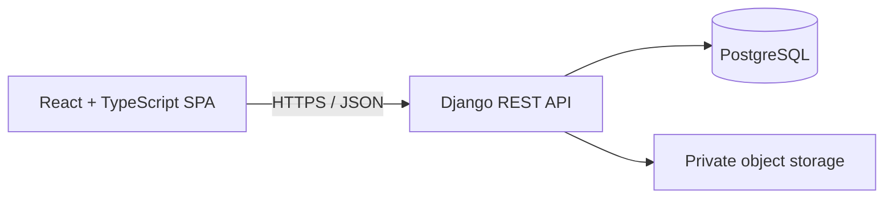
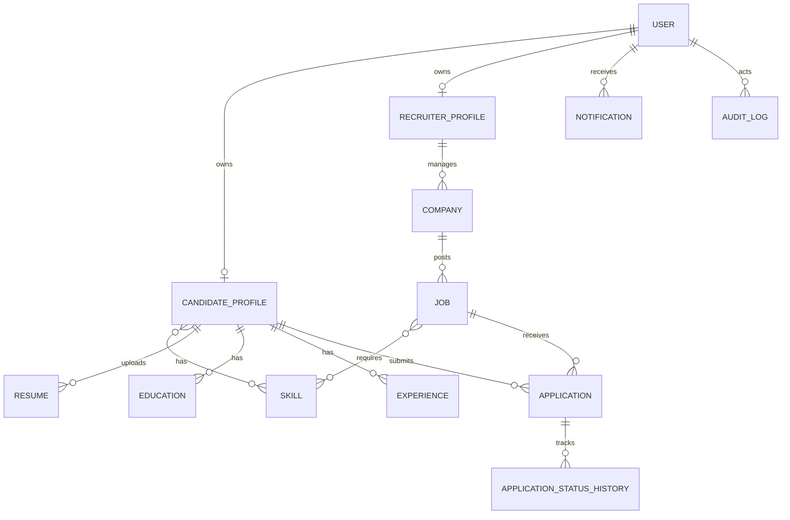

# HireFlow MVP architecture and data model

## System architecture



The REST API is the sole authority for role checks and business rules. React renders role-specific experiences but never grants access itself. PDF resumes are served only through an authorized API endpoint.

## Database ER diagram



## Backend layout

```text
backend/
  config/                 Django settings, URLs, ASGI/WSGI, Celery setup
  apps/
    accounts/             custom user, roles, auth and audit records
    candidates/           profiles, resumes, education, experience, skills
    recruiters/           recruiter profiles and companies
    jobs/                 jobs, skills and job-skill requirements
    applications/         applications and status timeline
  requirements/           pinned dependency sets
  tests/                  cross-app API and flow tests
```

## Frontend layout

```text
frontend/src/
  components/ layouts/ pages/ hooks/ services/ store/ types/ utils/
```

The frontend will use feature-owned page components, typed API clients, TanStack Query server-state caching, React Hook Form validation, and accessible design-system primitives.

## API architecture

All APIs will be under `/api/v1/`, use JSON, cursor/page pagination where appropriate, and return consistent validation errors:

```json
{"detail": "Validation failed.", "errors": {"field": ["Explanation"]}}
```

Views use serializers for input/output validation, queryset-scoped permissions, `select_related`/`prefetch_related` for relationship reads, and DRF filtering/ordering. OpenAPI documentation will be generated from the endpoints. Private endpoints require a JWT access token; refresh tokens are rotated and blacklistable.

## Authentication and authorization flow

1. User registers with exactly one role: candidate or recruiter; platform administrators are provisioned separately.
2. Django validates and hashes the password; email verification is required before sensitive workflows.
3. Login issues short-lived access and refresh JWTs.
4. API authentication resolves the user once per request; object-level permissions also verify ownership/company membership.
5. Logout/reuse protection blacklists refresh tokens. Password reset tokens are one-time and time-limited.

## Delivery phases

1. Architecture, schema, Django and Vite foundation
2. JWT authentication and role permissions
3. Candidate profiles, PDF resumes, saved jobs and applications
4. Recruiter companies, job publishing, applicant pipeline
5. Responsive React UI integration
6. Tests, Docker, documentation and deployment preparation
7. Deferred Phase 2: AI, Redis/Celery, email, interviews, analytics, messaging, admin UI and CI/CD
